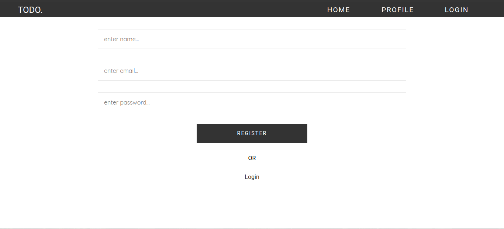
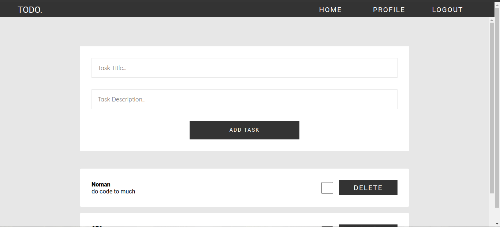
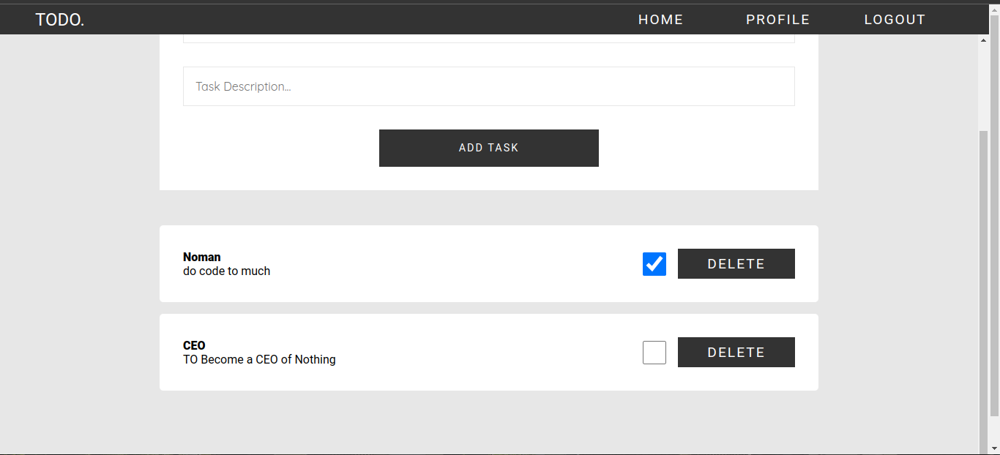

# This is Company Page Build with HTML5 and SCSS and Lastest NEXT13 using App Router

1 -> HTML5
2 -> SCSS
3 -> MongoDB
4 -> NEXT13 App Router

## Authors

- [@nomankhokhar](https://www.github.com/nomankhokhar)

## Badges

## 🚀 About Me

I'm a full Stack Developer...